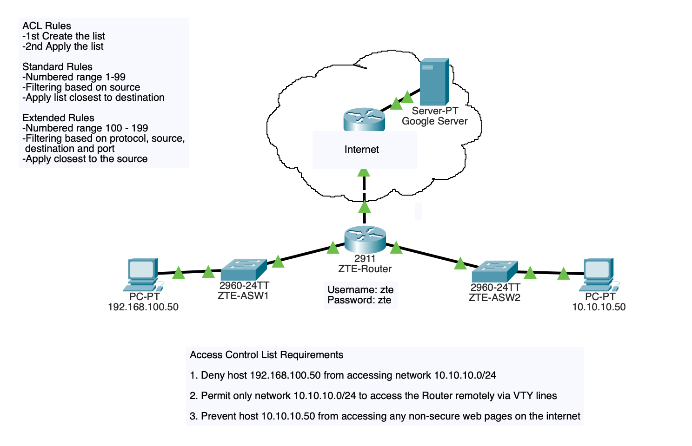

# Access Control Lists (ACLs)

## Topology

## Objective

Implement Standard and Extended Access Control Lists (ACLs) to control network traffic, restrict unauthorized access, and enforce security policies within a routed network environment.

## Technologies Used

- Standard ACLs
- Extended ACLs
- Cisco IOS
- Interface-Based Access Control
- VTY Access Restrictions

## Key Concepts

- Traffic filtering
- Source-based access control
- Protocol and port filtering
- Administrative access protection
- Security policy implementation

## Verification

- show access-lists
- show running-config
- Connectivity testing
- Telnet/SSH access validation

## Outcome

Successfully implemented ACL policies to control network traffic flow and administrative access. Demonstrated the ability to apply security controls at Layer 3 and enforce access restrictions based on source networks, protocols, and services.