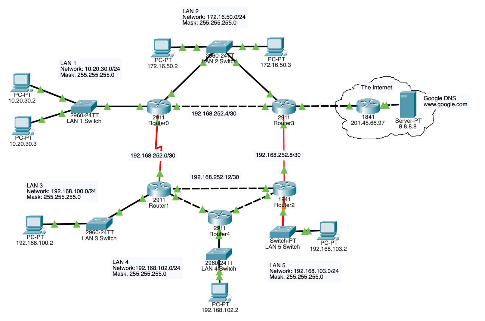

# Advanced RIP Operations

## Topology

## Objective

Enhance dynamic routing operations through default route propagation, passive interfaces, routing optimization, and load balancing.

## Technologies Used

- RIPv2
- Default Route Advertisement
- Passive Interfaces
- Multipath Routing
- Cisco IOS

## Key Concepts

- Route propagation
- Routing optimization
- Equal-cost load balancing
- Routing timers
- Internet route distribution

## Verification

- show ip route
- show ip protocols
- Routing table analysis
- Connectivity testing

## Outcome

Configured advanced RIP features including default route advertisement, passive interfaces, and multipath routing to improve routing efficiency, scalability, and traffic distribution.