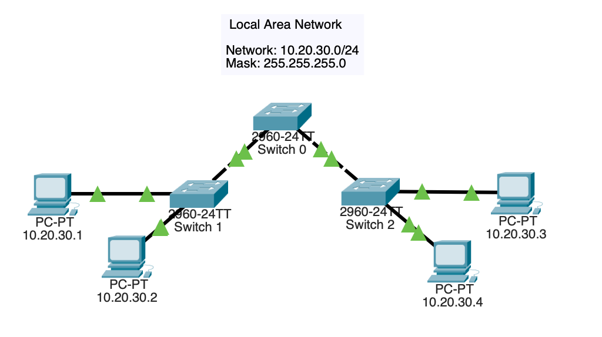

# Basic Switching

## Topology

## Objective

Examine fundamental Layer 2 switching operations and understand how switches forward traffic within a local area network.

## Technologies Used

- Ethernet Switching
- MAC Address Tables
- Cisco IOS
- Layer 2 Networking

## Key Concepts

- MAC address learning
- Frame forwarding
- Broadcast domains
- Switch operation
- Network connectivity

## Verification

- show mac address-table
- ping
- Connectivity testing

## Outcome

Developed a foundational understanding of Layer 2 switching by observing how switches learn MAC addresses, build forwarding tables, and efficiently deliver traffic between hosts within the same network.