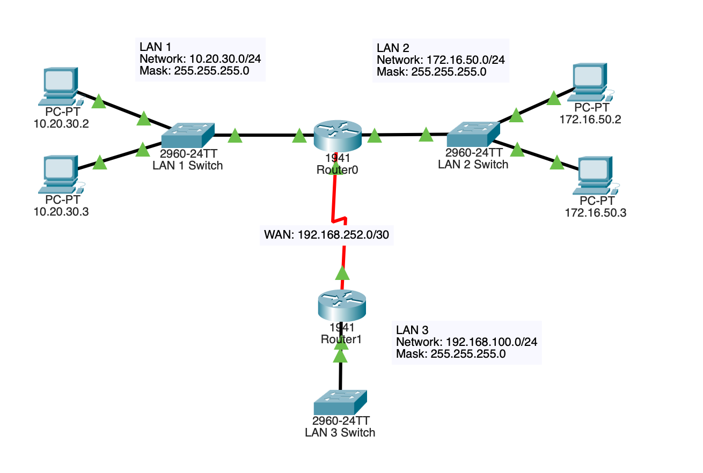

# Router Interface Configuration

## Topology

## Objective

Configure IPv4 addressing on router interfaces and establish Layer 3 connectivity between multiple network segments.

## Technologies Used

- Cisco IOS
- IPv4 Addressing
- Router Interfaces
- Layer 3 Routing

## Key Concepts

- Interface configuration
- Network addressing
- Gateway functionality
- End-to-end connectivity

## Verification

- show ip interface brief
- show running-config
- ping

## Outcome

Successfully configured router interfaces with appropriate IPv4 addressing and verified communication between connected networks. Developed a foundational understanding of Layer 3 device configuration and network connectivity validation.