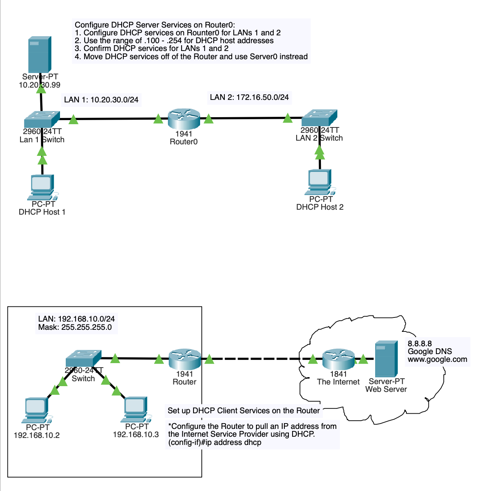

# DHCP Services

## Topology

## Objective

Deploy DHCP services to automate IP address assignment and reduce manual network configuration requirements.

## Technologies Used

- DHCP
- DHCP Relay
- Cisco IOS
- IP Helper Address

## Key Concepts

- Dynamic IP allocation
- DHCP pools
- Address exclusions
- DHCP relay services
- Centralized address management

## Verification

- show ip dhcp pool
- show ip dhcp binding
- ipconfig
- Client lease validation

## Outcome

Configured DHCP services across multiple network segments and implemented DHCP relay functionality to support centralized address management while ensuring reliable client provisioning.