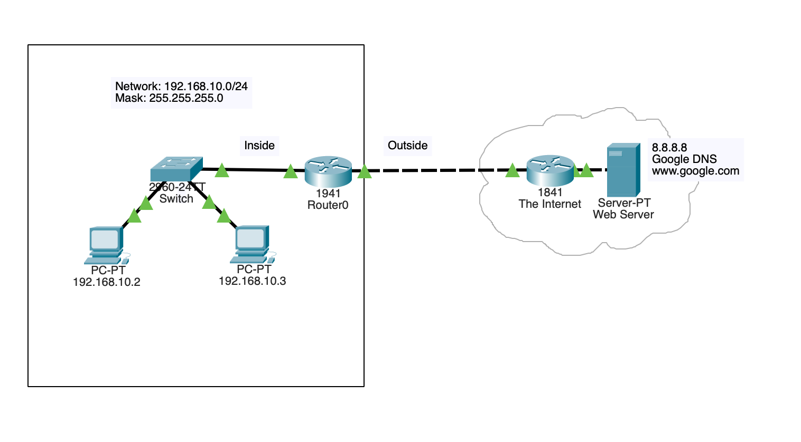

# NAT/PAT for Internet Access

## Topology

## Objective

Configure Network Address Translation (NAT) and Port Address Translation (PAT) to provide Internet connectivity for private networks while conserving public IPv4 address space.

## Technologies Used

- NAT
- PAT
- ACLs
- Cisco IOS

## Key Concepts

- Private and public addressing
- Address translation
- NAT overload
- Inside and outside interfaces
- Internet access configuration

## Verification

- show ip nat translations
- show ip nat statistics
- ping
- Web connectivity testing

## Outcome

Successfully implemented NAT overload (PAT) to allow multiple internal hosts to access external resources through a single public IP address while maintaining efficient utilization of IPv4 address space.