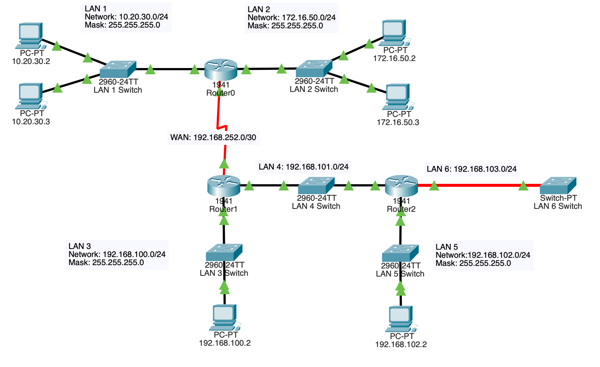

# Routing Information Protocol Version 2 (RIPv2)

## Topology

## Objective

Implement dynamic routing using RIPv2 to automatically exchange routing information between routers and establish network-wide connectivity.

## Technologies Used

- RIPv2
- Dynamic Routing
- Cisco IOS

## Key Concepts

- Route advertisement
- Dynamic route learning
- No auto-summary
- Routing convergence
- Network scalability

## Verification

- show ip route
- show ip route rip
- show ip protocols
- show ip rip database
- debug ip rip events

## Outcome

Successfully deployed RIPv2 across multiple routers, enabling automatic route propagation and eliminating the need for static routes while improving scalability and manageability.