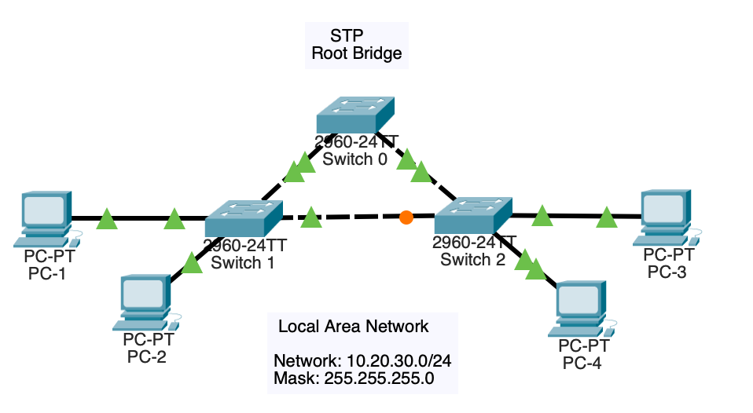

# Spanning Tree Protocol (STP)

## Topology

## Objective

Analyze Layer 2 redundancy and observe how Spanning Tree Protocol prevents switching loops while maintaining network availability.

## Technologies Used

- STP
- Cisco IOS
- Layer 2 Redundancy

## Key Concepts

- Root bridge election
- Port states
- Loop prevention
- Network convergence
- Redundant path failover

## Verification

- show spanning-tree
- Continuous ping testing
- Link failure simulation

## Outcome

Validated Spanning Tree Protocol operation by observing root bridge elections, port state transitions, and automatic activation of redundant links during network failures.