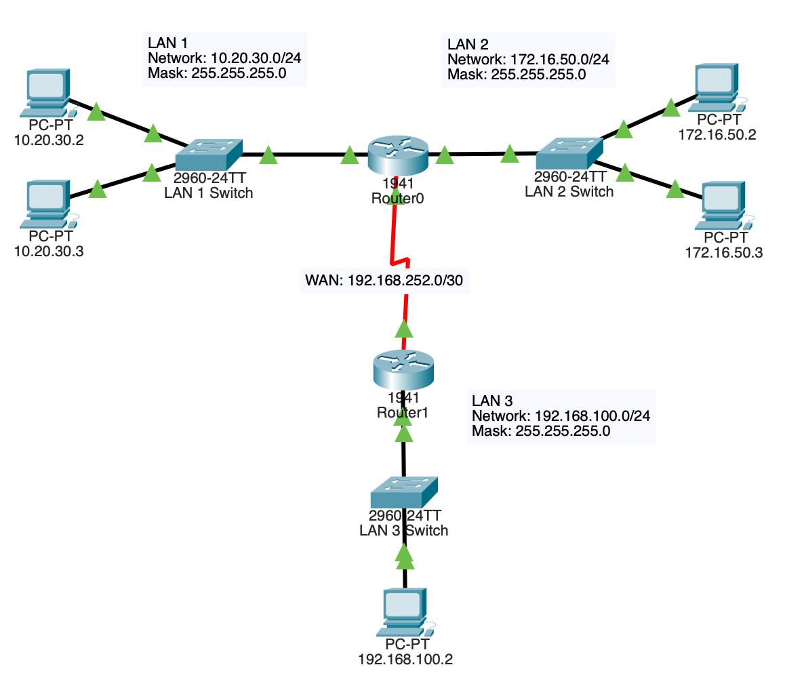

# Static Routing

## Topology

## Objective

Establish communication between remote networks through manually configured static routes.

## Technologies Used

- Static Routing
- Cisco IOS
- IPv4 Routing

## Key Concepts

- Route configuration
- Next-hop routing
- Route selection
- Network reachability

## Verification

- show ip route
- traceroute
- ping

## Outcome

Configured static routes to enable communication between multiple LANs and verified successful packet delivery through route analysis and troubleshooting procedures.