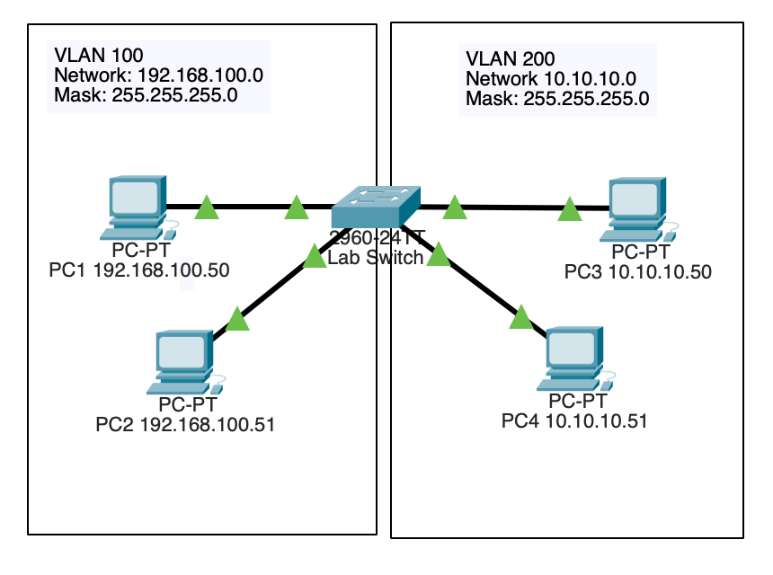

# Creating VLANs

## Topology

## Objective

Implement VLANs to logically segment a switched network and improve traffic isolation, security, and manageability.

## Technologies Used

- VLANs
- Cisco IOS
- Layer 2 Switching

## Key Concepts

- Network segmentation
- Broadcast domain separation
- VLAN assignment
- Switch port configuration

## Verification

- show vlan brief
- Connectivity testing
- VLAN membership validation

## Outcome

Successfully segmented network traffic into multiple VLANs, reducing broadcast traffic and improving network organization.