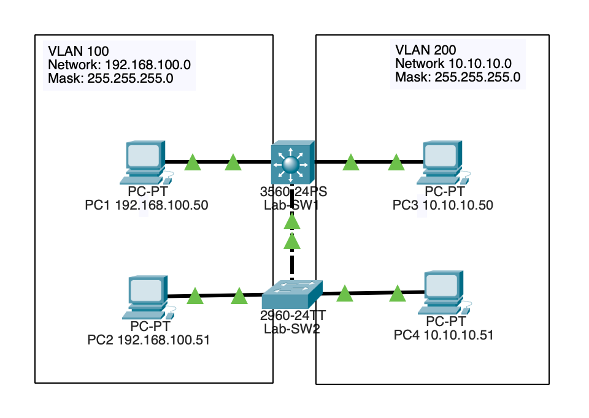

# Inter-VLAN Routing Using a Layer 3 Switch

## Topology

## Objective

Implement Inter-VLAN Routing using a multilayer switch to enable efficient communication between VLANs.

## Technologies Used

- Layer 3 Switching
- VLANs
- SVIs
- Cisco IOS

## Key Concepts

- Switched Virtual Interfaces (SVIs)
- Inter-VLAN Routing
- Multilayer Switching
- Gateway Services

## Verification

- show ip route
- show vlan brief
- show ip interface brief
- Ping between VLANs

## Outcome

Configured a multilayer switch to route traffic between VLANs, eliminating the need for an external router and improving network performance.