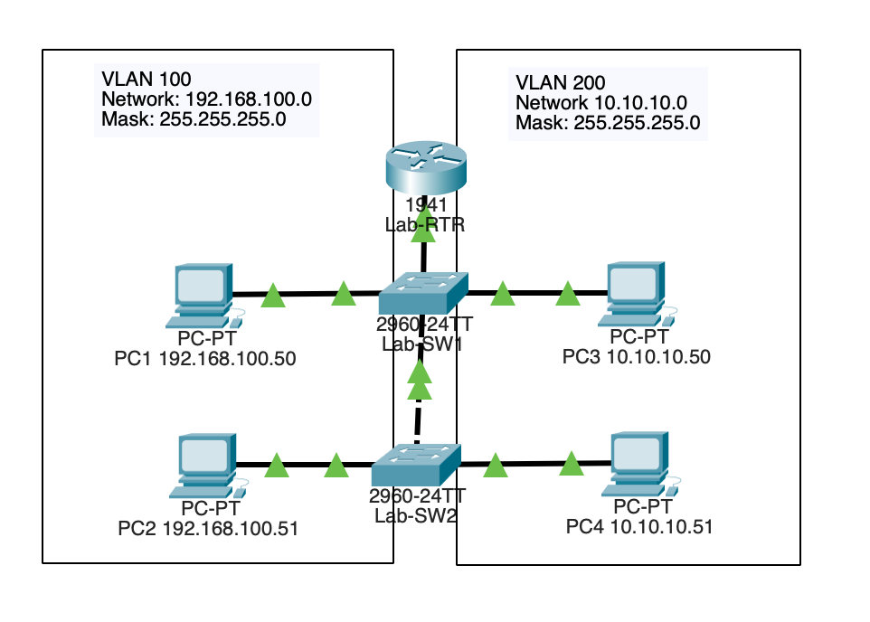

# Router-on-a-Stick

## Topology

## Objective

Enable communication between VLANs by implementing Inter-VLAN Routing through a router connected via an 802.1Q trunk.

## Technologies Used

- Router-on-a-Stick
- VLANs
- 802.1Q Trunking
- Cisco IOS

## Key Concepts

- Subinterfaces
- Inter-VLAN Routing
- Trunking
- Layer 3 Communication

## Verification

- show ip interface brief
- show running-config
- Ping between VLANs

## Outcome

Configured router subinterfaces and trunking to provide routing services between multiple VLANs while maintaining logical network segmentation.