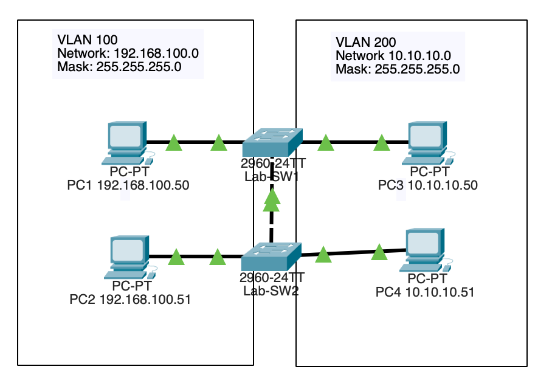

# VLAN Trunking Protocol (VTP)

## Topology

## Objective

Implement VTP to simplify VLAN administration and synchronize VLAN information across multiple switches.

## Technologies Used

- VTP
- VLANs
- Cisco IOS

## Key Concepts

- VTP Server
- VTP Client
- VLAN Synchronization
- Centralized Management

## Verification

- show vtp status
- show vlan brief
- VLAN propagation testing

## Outcome

Configured VTP to centrally manage VLAN information and automatically distribute VLAN updates throughout the switched network environment.